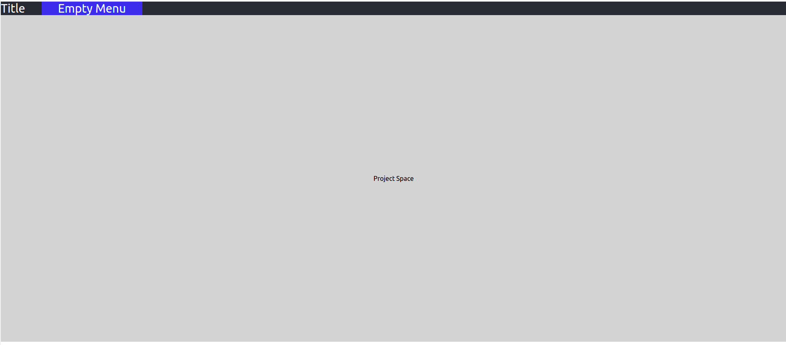
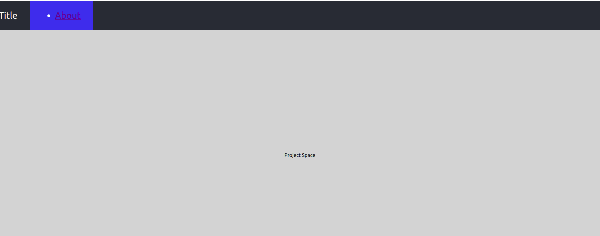
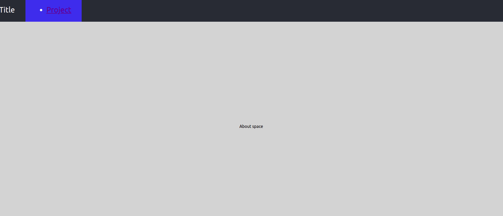

## Inject component through Context API

the goal of this spike is to validate that we can ``inject a component`` through React's Context API.

This pattern can be used to implement a menu that changes depending on the page where I am in the application.

## Getting started

```
git clone https://github.com/FabienArcellier/spike-react-context-api-component-injection.git
cd spike-react-context-api-component-injection

npm start
```

## References

* [Context Api](https://reactjs.org/docs/context.html)
* [Application State Management with React](https://kentcdodds.com/blog/application-state-management-with-react)

    Managing state is arguably the hardest part of any application. It's why there are so many state management libraries available and more coming around every day (and even some built on top of others.

* [How to use React Context effectively](https://kentcdodds.com/blog/how-to-use-react-context-effectively)

    In Application State Management with React, I talk about how using a mix of local state and React Context can help you manage state well in any React application.

## step 1 : build a complex canvas



## step 2 : implement a context provider to customize menu content

* take a look on [ApplicationMenuContext.tsx](./ApplicationMenuContext.tsx)
* take a look on [App.tsx](./App.tsx) for init
* look into [Project.tsx](./Project.tsx) for menu configuration

## step 3: implement different menu based on space

* implement a new space called About space
* configure menu based on space

* look into [Project.tsx](./Project.tsx)

```typescript jsx
// [...]
import {useConfigureMenu} from "./ApplicationMenuContext";

export const Project = () => {
    const [menu] = useState<JSX.Element>(
        <ul>
            <li><Link to={"/about"}>About</Link></li>
        </ul>
    )

    useConfigureMenu(menu)

    // [...]
}
```



* look into [About.tsx](./About.tsx)

